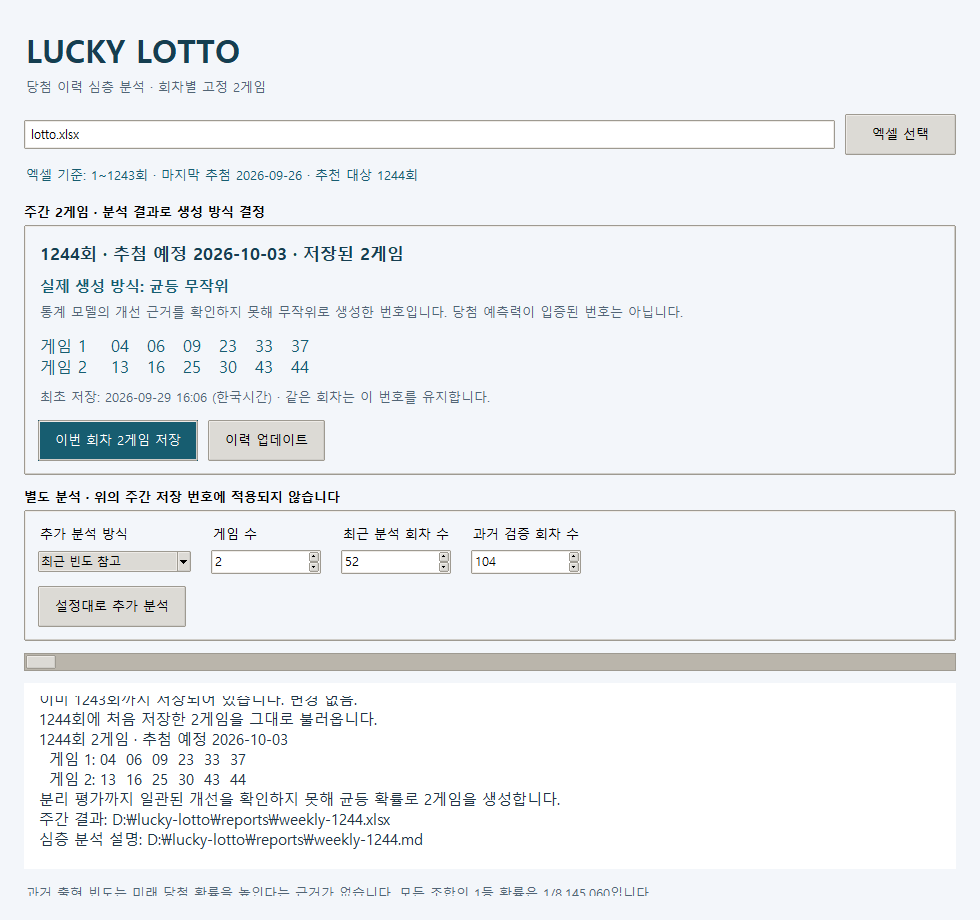

# 🍀 Lucky Lotto

**공식 당첨 이력을 분석하고, 매 회차 참고용 번호 2게임을 기록하는 데스크톱 프로그램.**

동행복권 API로 엑셀을 갱신하고, 통계 모델을 과거 데이터로 검증합니다. 개선을 확인하지 못하면 균등 무작위 방식으로 번호를 생성하며, 같은 회차에는 처음 저장한 두 게임을 유지합니다.


> 로또 당첨번호는 추첨기와 추첨볼로 결정됩니다. 이 프로젝트는 당첨 보장이나 난수 시드 복원을 목적으로 하지 않는 개인용 데이터 분석 도구입니다.

## 실행 화면



*실제 프로그램에서 1~1243회 이력과 저장된 1244회 추천을 표시한 화면입니다. 새 환경에서는 각 회차의 번호를 처음 생성한 뒤 고정합니다.*

## 빠른 시작

Windows와 **Python 3.11 또는 3.12**를 권장합니다. Python 설치 시 `Add python.exe to PATH`를 선택하세요.

```powershell
git clone https://github.com/Hongbaekson/lucky-lotto.git
cd lucky-lotto
.\start.cmd
```

Git 없이 사용하려면 **Code → Download ZIP**으로 내려받아 압축을 풀고 `start.cmd`를 더블클릭해도 됩니다. 최초 실행 시 프로젝트 전용 `.venv`에 필요한 패키지를 설치합니다.

1. `lotto.xlsx`가 Excel에서 열려 있다면 닫습니다.
2. **이번 회차 2게임 저장**을 누릅니다.
3. 최신 회차 확인 → 엑셀 갱신 → 심층 분석 → 두 게임 저장이 진행됩니다.
4. 화면에서 번호를 확인하고 `reports` 폴더에서 상세 결과를 엽니다.

같은 회차에는 저장된 번호를 불러오고, 다음 추첨 결과가 발표되면 그다음 회차의 두 게임을 생성합니다. **설정대로 추가 분석**에서는 다른 방식도 비교할 수 있으며, 주간 저장 번호는 변경하지 않습니다.

주간 번호 옆에는 **실제 생성 방식·선택 이유·최초 저장 시각**이 표시됩니다. 아래의 **별도 분석** 영역에서 고르는 `최근 빈도 참고` 등의 설정은 주간 번호에 적용되지 않습니다. 주간 생성 방식이 `균등 무작위`라면 무작위로 생성해 저장한 참고용 번호입니다.

포함된 [lotto.xlsx](lotto.xlsx)는 **1~1243회** 이력입니다. 인터넷은 최신 회차 확인과 최초 패키지 설치에 필요합니다. 프로그램은 사용자가 실행할 때 동작합니다.

## 주요 기능

| 기능 | 내용 |
| --- | --- |
| 공식 데이터 업데이트 | 최신 확정 회차와 기존 빈칸을 API로 갱신 |
| 회차별 2게임 | 서로 다른 번호 6개로 구성된 두 조합을 최초 저장 후 유지 |
| 심층 통계 분석 | 번호 빈도·번호쌍·시간 변화·반복·홀짝·합계·연속수 검사 |
| 시간순 모델 검증 | 7개 모델을 비교하고 마지막 208회를 따로 평가 |
| 결과 파일 | 추천 번호, 전체 진단, 모델 비교를 Excel과 Markdown으로 저장 |
| 원본 보존 | 수정 전 백업, 기존 값 충돌 확인, 원자적 파일 교체 |

## 분석과 추천 원리

**우연한 패턴을 구분합니다.** 번호별 빈도 45개, 번호쌍 990개, 전후반 변화 45개, 회차 간격 10개, 조합 분포 3개의 **총 1,093개 검사**에 Holm 다중검정 보정을 적용합니다. 많은 패턴을 살펴보면서 우연히 발견한 차이를 과대평가하지 않기 위한 절차입니다.

**미래 데이터를 미리 사용하지 않습니다.** 처음 208회는 준비 데이터로 쓰고, 이후 매 회차 그 이전 이력으로만 예측합니다. 마지막 208회는 모델 선택에서 제외해 따로 평가합니다. 최소 624회의 연속 이력이 필요합니다.

**검증 결과로 추천 방식을 정합니다.** 균등 기준, 누적 빈도, 최근 26·52·104회 빈도, 최근 가중 평균, 직전 번호와 다음 회차 관계의 7개 모델을 비교합니다. 번호별 확률오차인 Brier 점수와 블록 부트스트랩의 근사 95% 구간을 확인합니다. 선택 구간과 분리 평가에서 모두 개선 기준을 통과한 후보가 없으면 균등 방식을 사용합니다.

**저장한 번호를 유지합니다.** 운영체제 난수로 서로 다른 두 조합을 만들고 `weekly/회차.json`에 기록합니다. 재실행이나 동시 실행으로 최초 기록을 덮어쓰지 않으며, 기준 데이터가 달라지면 확인 오류를 표시합니다.

엑셀의 번호1~6은 오름차순이며 실제 공이 나온 순서가 아닙니다. 번호별 확률오차가 작아지는 것과 1등 조합을 맞히는 것도 다릅니다. 공정한 추첨에서 서로 다른 두 게임 중 1등이 있을 확률은 **1 / 4,072,530**입니다.

### 분석 결과 예시

**2026-09-29 · 1~1243회 분석**에서는 보정 후 유의한 진단 항목이 없었고, 통계 모델의 일관된 개선도 확인하지 못했습니다. 따라서 1244회에는 균등 방식이 선택되었습니다. 이 결과가 공정성을 증명하거나 미래 성능을 보장하지는 않습니다.

- [심층 분석 보고서 — 검정 방법과 모델 비교](docs/examples/weekly-1244.md)
- [결과 엑셀 — 추천 번호·진단 1,093개·모델 비교·빈도 차트](docs/examples/weekly-1244.xlsx)

## 명령어로 사용하기

`start.cmd`로 설치하지 않았다면 먼저 가상환경과 패키지를 준비합니다.

```powershell
python -m venv .venv
.\.venv\Scripts\python.exe -m pip install -r requirements.txt
```

```powershell
# 최신 이력 확인 → 심층 분석 → 이번 회차의 고정 2게임 저장
.\.venv\Scripts\python.exe lotto.py weekly

# 인터넷 확인 없이 저장된 이력으로 실행 — 기준 회차를 직접 확인하세요
.\.venv\Scripts\python.exe lotto.py weekly --offline

# 공식 최신 회차까지 엑셀 갱신
.\.venv\Scripts\python.exe lotto.py update

# 최근 52회 빈도를 참고한 별도의 2게임 분석
.\.venv\Scripts\python.exe lotto.py report --games 2 --mode recent --window 52

# 같은 입력과 시드로 추가 분석 결과 재현
.\.venv\Scripts\python.exe lotto.py report --mode random --seed 42
```

다른 원본은 `lotto.py --file "D:\data\lotto.xlsx" weekly`처럼 지정합니다. 추가 분석의 `--mode`는 `random`, `frequency`, `recent`를 지원하며 주간 추천과 별개인 비교용 기능입니다.

## 데이터와 파일

| 경로 | 용도 |
| --- | --- |
| `lotto.xlsx` | 당첨 이력 원본 |
| `lotto.py` | API 갱신, 엑셀 처리, 명령어 실행 |
| `lotto_gui.py` | Tkinter 화면 |
| `lotto_analysis.py` | 통계 검정과 시간순 모델 평가 |
| `lotto_weekly.py` | 회차별 2게임 기록과 결과 파일 생성 |
| `docs/` | 실제 화면 이미지와 공개 분석 예시 |
| `backups/` | 수정 직전 엑셀 백업 — 실행 시 생성 |
| `weekly/` | 회차별 최초 추천 기록 — 실행 시 생성 |
| `reports/` | 사용자 환경의 분석 결과 — 실행 시 생성 |

백업·개별 추천 기록·실행 결과·가상환경은 Git에서 제외합니다. 공개 예시만 `docs/examples`에 별도로 보관합니다.

원본은 `회차 / 추첨일 / 번호1~번호6 / 보너스 / 1등당첨금 / 1등당첨자수 / 총판매금액`의 12개 열을 사용합니다. 1등당첨금은 게임당 금액이고, 총판매금액은 API의 `wholEpsdSumNtslAmt`입니다.

1회부터 연속된 오름차순 이력을 사용하며 기존 시트와 셀 서식을 유지합니다. 기존 값과 API 응답이 충돌하거나 요청 중 오류가 나면 저장을 중단합니다. Excel에서 파일을 열어 둔 경우에는 닫고 다시 실행하세요.

## 검증

```powershell
.\.venv\Scripts\python.exe -m unittest -v
```

10개 테스트에서 원본·서식 보존, 부분 저장 방지, 미래 데이터 차단, 모델 선택과 최종 평가의 분리, 동시 저장 및 같은 회차의 번호 유지 등을 검사합니다. 테스트는 임시 파일을 사용합니다.

## 데이터 출처

- [동행복권 회차별 결과 API](https://www.dhlottery.co.kr/lt645/selectPstLt645Info.do?srchLtEpsd=1243)
- [동행복권 로또 6/45 안내](https://m.dhlottery.co.kr/lt645/intro)
- [동행복권 추첨 원리와 절차](https://factcheck.dhlottery.co.kr/)
- [MBC 로또 공개 추첨 현장](https://news.imbc.com/original/mbig/6659750_29041.html)

동행복권의 공식 서비스와 별개인 개인 프로젝트입니다. 공식 API 형식이 바뀌면 필드 대응을 확인해야 합니다.
